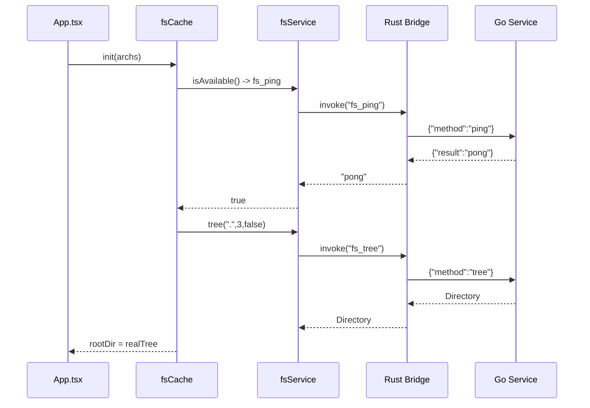
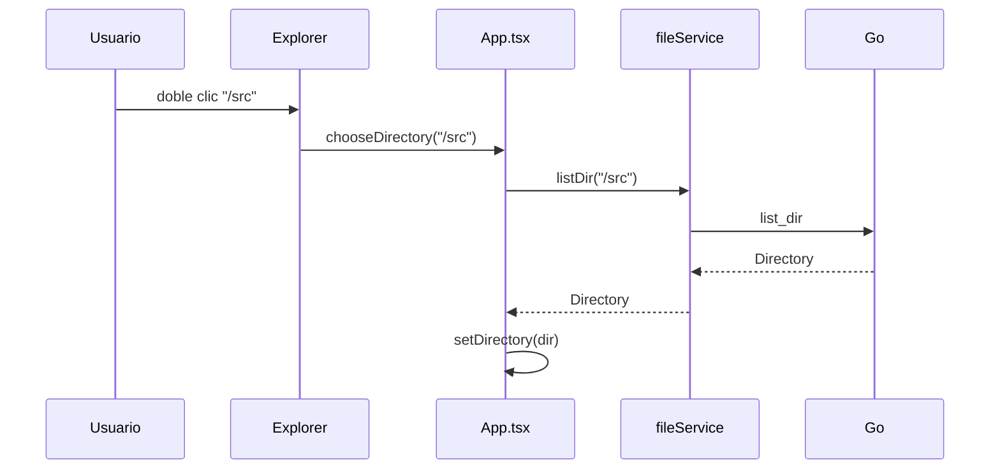

# Killer — Arquitectura Completa (Go + Rust + SolidJS)

## Visión General

```
SolidJS (Vite)  --Tauri invoke-->  Rust (Tauri)  --stdio IPC-->  Go (Filesystem)
     UI                bridge              sidecar                corazón
```

- **Go (`/killer/go`)**: el *verdadero corazón*. Implementa todo el filesystem real (`ListDir`, `ReadFile`, `Tree`, etc.) y expone un servidor JSON line-delimited por `stdin`/`stdout`. Ver `go/README.md`.
- **Rust (`/killer/src-tauri/src/go_bridge`)**: corre Go como proceso hijo, mantiene el túnel IPC, y expone comandos Tauri que el frontend invoca. Ver `src-tauri/src/go_bridge/*.rs`.
- **Frontend (`/killer/src/services`, `/types`, `/cache`)**: SolidJS consume el FS vía `fsService` (que hace `invoke`) y tiene fallback a mock para modo web.

---

## Túnel IPC (Internal Communication Process)

Un túnel simple, sin HTTP ni sockets: **JSON por línea**.

**Request (Rust → Go, por stdin):**
```json
{"id":"uuid","method":"list_dir","params":{"path":"/src"}}
```

**Response (Go → Rust, por stdout):**
```json
{"id":"uuid","result":{"type":"dir","path":"/src/","name":"src","directorys":[],"files":[]},"error":null}
```

- `stderr` es solo para logs humanos (`[go] ...`, `[rust] ...`) y no interfiere.
- Go procesa secuencialmente; Rust serializa con `Mutex` (`call_lock`) para mantener orden.

**Flujo de un `listDir`:**
```ts
// 1. Solid
await fsService.listDir("/src") // -> invoke("fs_list_dir", {path:"/src"})

// 2. Rust (go_bridge/sidecar.rs)
let v = bridge.call("list_dir", json!({"path":"/src"})).await?;
//  -> escribe linea JSON a Go stdin, lee linea de Go stdout

// 3. Go (internal/ipc/server.go)
case "list_dir": dir, _ := svc.ListDir(p.Path); return okResponse(id, dir)

// 4. Rust deserializa y retorna Value a JS
// 5. Solid recibe Directory
```

---

## Go — Corazón Filesystem

Ver `go/README.md` para detalles. Resumen de archivos:

- `go/internal/fs/types.go`: `Directory`, `FileDeck`, `File`, `Stat` — contrato JSON.
- `go/internal/fs/fs.go`: `Service` con `ListDir`, `ReadFile`, `Stat`, `Tree`, `WriteFile`, `Delete`, etc. Usa solo `os`/`filepath`.
- `go/internal/ipc/protocol.go`: `Request`/`Response`.
- `go/internal/ipc/server.go`: loop `Scanner` + `dispatch`.
- `go/main.go`: `main()` que inicia `Server` y maneja `SIGINT`/`SIGTERM`.

**Compilar y probar:**
```bash
go vet ./go/... && go build -o /tmp/killer-go ./go
echo '{"id":"1","method":"ping","params":{}}' | /tmp/killer-go
```

---

## Rust — Puente y Sidecar

**Cargo:**
```toml
[dependencies]
tauri = { version = "2" }
tokio = { version = "1", features = ["full"] }
uuid = { version = "1", features = ["v4"] }
```

**Módulos:**
- `src-tauri/src/go_bridge/protocol.rs`: `GoRequest`/`GoResponse`.
- `src-tauri/src/go_bridge/sidecar.rs`: `GoBridge` que spawnea Go, mantiene `Child`, `stdin`, `stdout`, y `call()` secuencial. Busca binario en `src-tauri/binaries/killer-go*`, `../go/killer-go`, `/tmp/killer-go`, o `KILLER_GO_BIN`.
- `src-tauri/src/go_bridge/mod.rs`: comandos Tauri `fs_ping`, `fs_list_dir`, `fs_read_file`, `fs_stat`, `fs_tree`, etc. Cada uno es proxy delgado `bridge.call().await`.
- `src-tauri/src/lib.rs`: `setup` spawnea `GoBridge::new()` y lo guarda con `app.manage()`, y registra `invoke_handler`.

**Build del sidecar:**
`src-tauri/build.rs` intenta `go build -o binaries/killer-go ../go` automáticamente en `cargo build`. Si `go` no está, solo advierte y el runtime hace fallback.

**Comandos expuestos a JS:**
```ts
import { invoke } from "@tauri-apps/api/core"
await invoke("fs_ping")
await invoke("fs_list_dir", { path: "/src" })
await invoke("fs_read_file", { path: "/src/App.tsx" })
await invoke("fs_tree", { root: ".", maxDepth: 2, showHidden: false })
```

---

## Frontend — Services / Types / Cache

### `/src/types/fs.ts` (fuente de verdad)
Define `Directory`, `FileDeck`, `Fille`, `Stat`, `TreeOptions`. Es idéntico a `go/internal/fs/types.go`. `src/types/cache.ts` re-exporta para compatibilidad.

```ts
import type { Directory, Fille } from "../types/fs"
const dir: Directory = await fsService.listDir("/src")
```

### `/src/services/fsService.ts` (cliente IPC)
Wrapper de `invoke` con fallback. Detecta `isTauri()` via `window.__TAURI__`.

```ts
import { fsService } from "../services/fsService"
if (await fsService.isAvailable()) {
  const dir = await fsService.listDir("/src")
}
```

Métodos: `ping()`, `listDir(path)`, `readFile(path)`, `stat(path)`, `tree(root,maxDepth,showHidden)`, `writeFile(path,data)`, `delete(path)`, `exists(path)`, `ensureDir(path)`, `loadInitialDir(fallback)`.

### `/src/services/fileService.ts` (híbrido)
Mantiene API sincrónica mock (`getFileByPath`, `getDirectoryByPath`) para compatibilidad, y añade API asíncrona real que intenta `fsService` y hace fallback a mock.

```ts
const real = await fileService.listDir("/src", archs)
const file = await fileService.readFile("/src/App.tsx")
```

### `/src/cache/file.ts` (mock)
Árbol `archs` y `listFiles` para modo web. Ahora documentado como fallback.

### `/src/cache/fsCache.ts` (cache reactivo)
Singleton en memoria que guarda `cachedTree` y `isRealFs`.

```ts
import { fsCache } from "../cache/fsCache"
const root = await fsCache.init(archs, ".") // intenta Go, fallback mock
const dir = await fsCache.navigate("/src/components")
const file = await fsCache.readFile("/src/App.tsx")
```

Usado por `App.tsx` en `onMount`.

### `/src/App.tsx`
- `rootDir` signal: inicia mock, luego `fsCache.init` lo reemplaza con real.
- `directory` signal: carpeta actual.
- `chooseDirectory` y `chooseFile` son `async` y usan `fileService` híbrido.
- `ChooseDirectoryOfEnter` recibe `rootDir()` y navega con `history` stack, haciendo `fileService.listDir` para cargar hijos reales cuando el árbol cacheado es poco profundo.

---

## Diagramas

### Secuencia de inicio


### Navegación


---

## Desarrollo

```bash
# 1. Go
cd killer/go
go vet ./... && go build -o /tmp/killer-go . && echo '{"id":"1","method":"ping","params":{}}' | /tmp/killer-go

# 2. Frontend (web mock)
cd killer
pnpm dev # vite en http://localhost:1420

# 3. Tauri + Go real
cd killer
go build -o src-tauri/binaries/killer-go ./go
cargo run --manifest-path src-tauri/Cargo.toml # o pnpm tauri dev
```

---

## Buena Arquitectura — Principios

- **Separación**: Go hace FS, Rust hace IPC, Solid hace UI. Ninguno conoce detalles internos del otro, solo JSON.
- **Contrato único**: `types.go` y `types/fs.ts` son idénticos. Cambiar uno obliga a cambiar el otro.
- **Fallback**: Todo lo real tiene fallback mock para seguir desarrollando en web sin sidecar.
- **Documentación con bloques**: cada archivo tiene `// ```go` o `/** ```ts` con ejemplos para entender el flujo sin leer todo el repo.
- **Sin dependencias pesadas**: Go usa stdlib; Rust usa tokio ya presente en Tauri.
